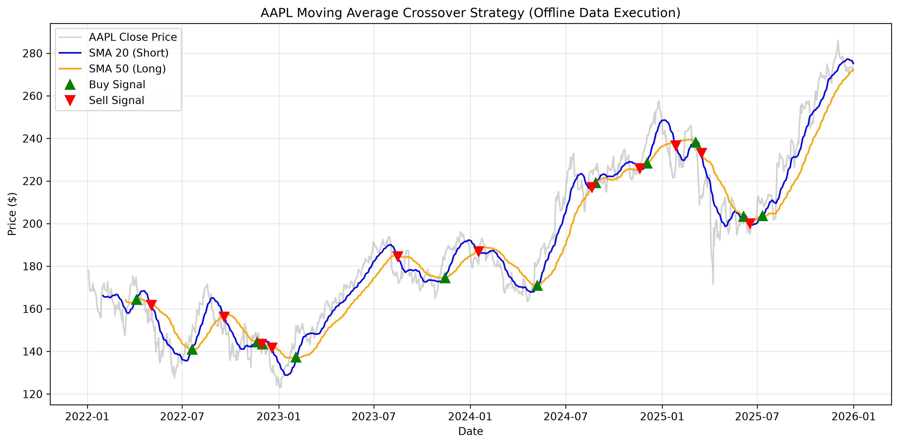
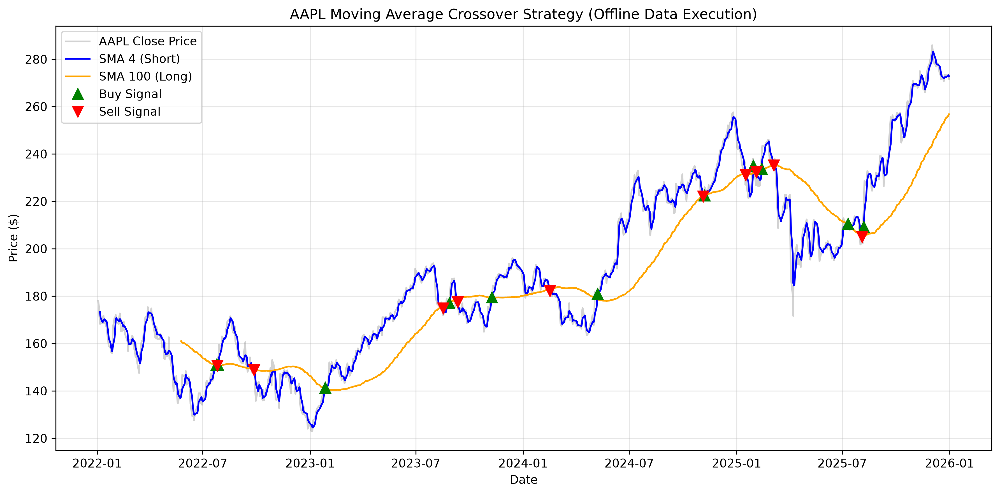

# CS201-Mini-Project-Turinskyi
# Розробка простого торгового алгоритму на Python 
# Створено Іваном Турінським

Цей проєкт має на меті ознайомитись із основними аспектами алгоритмічної 
торгівлі через процес отримання фінансових даних і розробки базової 
моделі торгівлі. Виконуючи проєкт, здобуто практичний досвід отримання 
ринкових даних, їх аналізу для визначення закономірностей або тенденцій, а також 
побудови моделі на основі правил, яка може інформувати торговельні рішення. Цей 
практичний підхід покращить розуміння того, як керовані даними стратегії 
формулюються та застосовуються на фінансових ринках, закладаючи основу для 
більш просунутих досліджень. 

Обрано предмет аналізу — акція корпорації Apple (AAPL). Актив зацікавив, тому що опередній моніторинг динаміки показав стабільний ріст ціни акції за останні роки, також є дивіденди у розмірі близько 2-3% річних, а коливання ціни на акцію через новини успіх/неуспіх останніх продуктів Apple дозволяють добре заробляти на купівлі дешево/продажі дорого акцій компанії.

Окрім вираженого тренду динаміки росту, акції Apple є дуже популярними - що робить дані про них детальними й доступними, а сам актив - ліквідним, що усуває проблеми із купівлею і продажем акцій коли приймається таке рішення. Усе це дозволить розробленому торговому алгоритму стабільно та надійно працювати.

# Опис процесу аналізу (які інструменти та бібліотеки використовувалися):
У зв'язку із бот-блокуванням запитів API фінансовими сайтами Yahoo та Stooq при спробі доступу через Python, історичні котирування акцій AAPL (2022–2026) завантажувалися з локального датасету aapl_us_d.csv, який можна знайти за посиланням https://stooq.com/q/d/?s=aapl.us.

Використані бібліотеки: 
* **Pandas** — зчитування даних, обробка часових рядів (`DatetimeIndex`), розрахунок ковзних вікон (`.rolling()`) та накопиченої дохідності (`.cumprod()`).
* **NumPy** —  логіка визначення торговельних позицій (`np.where`).
* **Matplotlib** — візуалізація цінових графіків, ліній скоригованих середніх та точкових маркерів покупок/продажів (`plt.plot()`, `savefig()`).
+ Усі етапи розобки та деталі можна знайти у комітах, та в коментарях файлу Py_Main.py.
# Висновки щодо ефективності торгової стратегії:
Спершу були значення short_window = 20 і long_window = 50, що дало результати:
Buy & Hold Market Return:    52.50%
SMA Crossover Strategy:      18.35%
Що робило торговий алгоритм навіть гіршим ніж просто покупка і утримування акції весь час.
Нижче наведено графік, що демонструє стратегію перетину SMA 20 днів і SMA 50 днів із поведінкою ціни акцій Apple (2022–2026):

Потім, в результаті кількох підборів значень днів було отримано оптимальні значення: 
short_window = 4 і long_window = 100, що дало результати вище ринкових:
Buy & Hold Market Return:    52.50%
SMA Crossover Strategy:      62.05%

* Отже, для цієї конкретної акції підійшли дуже короткий час реакції на зміни short_window = 4 та довгий перевірочний поріг long_window = 100 для уникнення збитків та ефективного Buy і Sell акцій, перевершивши результат ринкового утримування, що є успіхом для цього алгоритму.

* Нижче наведено графік, що демонструє стратегію перетину SMA 4 днів і SMA 100 днів із поведінкою ціни акцій Apple (2022–2026):
